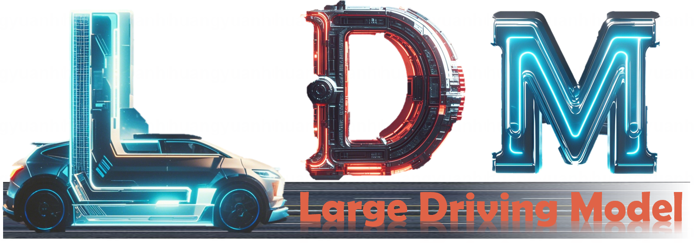
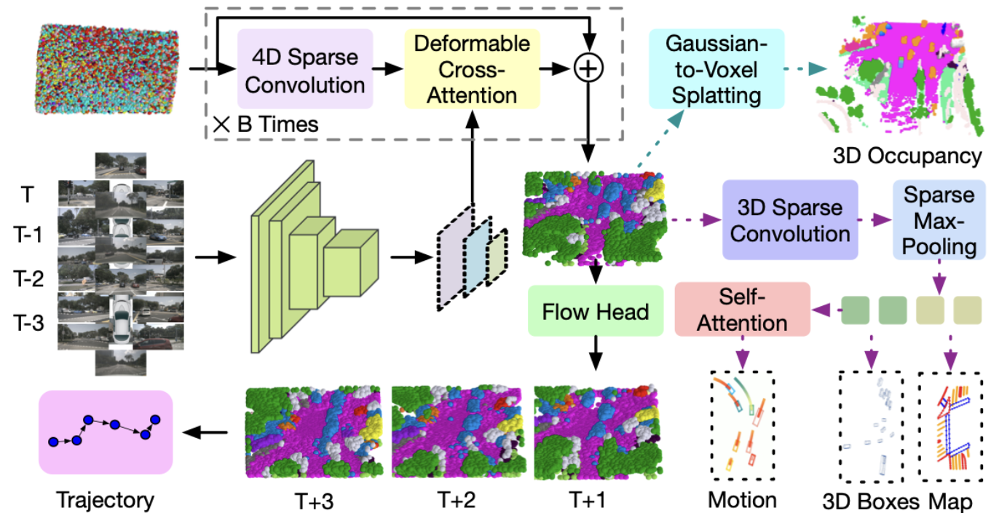

# GaussianAD: Gaussian-Centric End-to-End Autonomous Driving
### [Paper](https://arxiv.org/pdf/)  | [Project Page](https://wzzheng.net/GaussianAD)  | [Code](https://github.com/wzzheng/GaussianAD) 


Check out our [Large Driving Model](https://github.com/wzzheng/LDM/) Series! 

> GaussianAD: Gaussian-Centric End-to-End Autonomous Driving

> [Wenzhao Zheng](https://wzzheng.net/)\* $\dagger$, [Junjie Wu]()\*, [Yao Zheng]()\*, [Sicheng Zuo](https://github.com/zuosc19), [Zixun Xie](), [Longchao Yang](), [Yong Pan](), [Zhihui Hao](), [Peng Jia](),[XianPeng Lang](),[Shanghang Zhang](https://www.shanghangzhang.com/)

\* Equal contribution $\dagger$ Project leader

GaussianAD is a Gaussian-centric end-to-end framework which employs sparse yet comprehensive 3D Gaussians to pass information through the pipeline to efficiently preserve more details.

## News

- **[2024/12/16]** Paper released on [arXiv](https://arxiv.org/abs/).

## Demo


## Overview




## Getting Started

Code will be released after the company verifies. 

## Related Projects

Our code is based on the excellent work [GaussianFormer](https://github.com/huang-yh/GaussianFormer).

## Citation

If you find this project helpful, please consider citing the following paper:
```
@article{gaussianad,
    title={GaussianAD: Gaussian-Centric End-to-End Autonomous Driving},
    author={Wenzhao Zheng, Junjie Wu, Yao Zheng, Sicheng Zuo, Zixun Xie, Longchao Yang, Yong Pan, Zhihui Hao, Peng Jia, XianPeng Lang, Shanghang Zhang},
    journal={arXiv preprint arXiv: xxx},
    year={2024}
}
```
